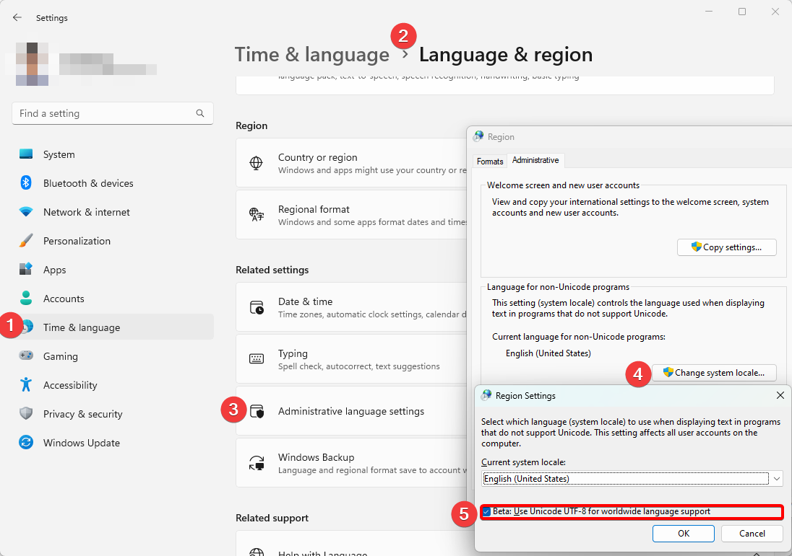

This repository provides a support function for Ansys medini analyze to generate contents from external LLM.

For users who use languages that have non ASCII characters, such as Japanese, Chinese, and Korean, please turn on the following settings in Windows.

For more details, check the follow sites.

- [Ansys medini analyze](https://www.ansys.com/products/safety-analysis/ansys-medini-analyze)
- [Ansys medini analyze support site](https://medini.ansys.com/)
- [Ansys medini analyze forum](https://medini.freshdesk.com/)
- [Ansys medini analyze online help](https://ansyshelp.ansys.com/account/secured?returnurl=/Views/Secured/prod_page.html?pn=medini%20analyze&pid=Medini&lang=en)
